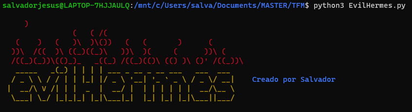
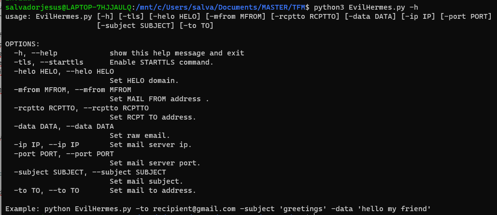
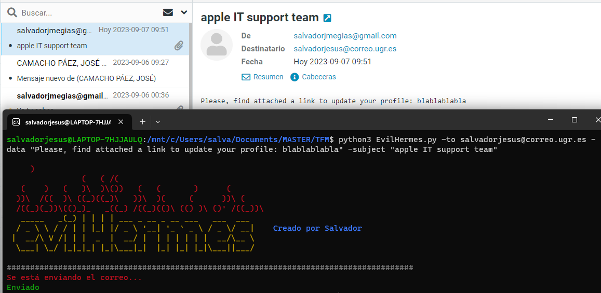

# EvilHermes


## Project Summary 📃

Tool developed to help detect vulnerabilities in the authentication systems (DKIM, SPF, DMARC) of SMTP servers:


## Starting 🚀

_These instructions will allow you to get a working copy of the project on your local machine for development and testing purposes.._




See **Deployment** to learn how to deploy the project.


### Pre requirements 📋

* Python version used during development : **3.8.10**
* Version of pip used during development: **20.0.2**


### Installation 🔧

Possible modes of use depending on the version of pip you have:

```
pip install -r requirements.txt
```

or
```
pip3 install -r requirements.txt
```


## Deployment 📦

**Command-line interface:**



**Example of use:**



## Built with 🛠️


* [Python](https://www.python.org/) - Programming language used
    * [smtplib](https://docs.python.org/3/library/smtplib.html) -For sending emails
    * [argparse](https://docs.python.org/3/library/argparse.html) - For command-line interface development
    * [dkim](https://pypi.org/project/dkimpy/) - For dkim management

## Author ✒️

* **Salvador Jesús Megías Andreu** - [salvadorJMA](https://github.com/salvadorJMA)


## License 📄

This project is licensed under the MIT License - see the [LICENSE](LICENSE) file for details

## Expressions of Gratitude 🎁

* Tell others about this project 📢
* Buy me a beer 🍺 or a coffee ☕. 


---
⌨️ with ❤️ by [Salvador Megías Andreu](https://github.com/salvadorJMA) 😊
